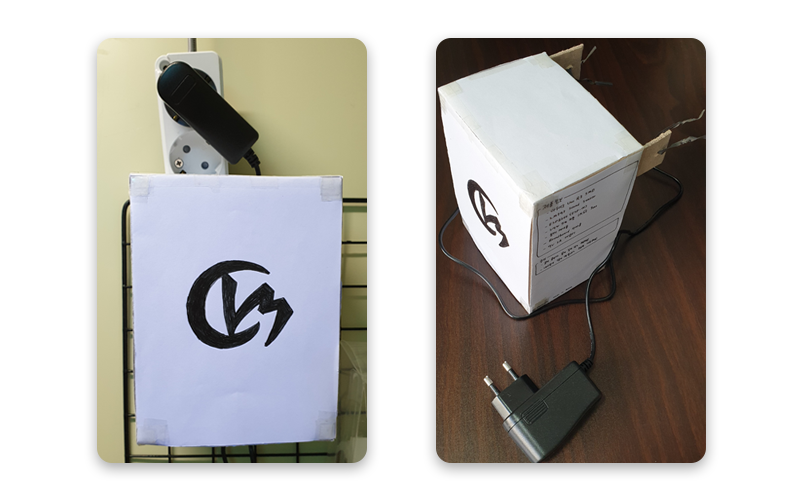
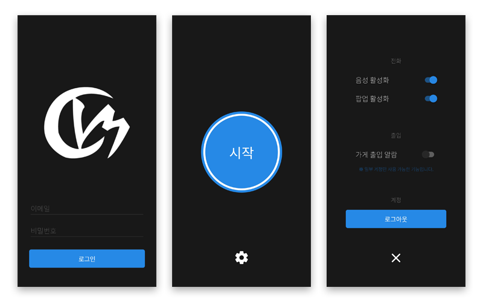

# bangull
방울아이 고객관리 프로그램의 데이터베이스와 연동하여 전화가 왔을 때 고객에 대한 정보를 알려주고
가게에 출입 이벤트가 발생했을 때 알림을 주는 앱과 아두이노 기기입니다.

부모님께서 가게를 비우실 때나 떡을 제조하는 작업을 하고 계실 때 손님이 가게에 출입하는지를 알고 싶다고 하셔서 만들게 되었습니다.
기존에 사용하던 적외선 벨이 울리면 사운드 센서(LM393)로 감지 후 ESP8266(ESP-01) 모듈을 통해 서버로 데이터를 전달하고
서버에서 FCM 이벤트를 보내 휴대전화에서 출입 알림을 받을 수 있도록 구현했습니다.
그리고 기기에 개인 시리얼 번호를 부여해 서버에서 검증하는 방식을 사용하고 있습니다.

## Screenshot

